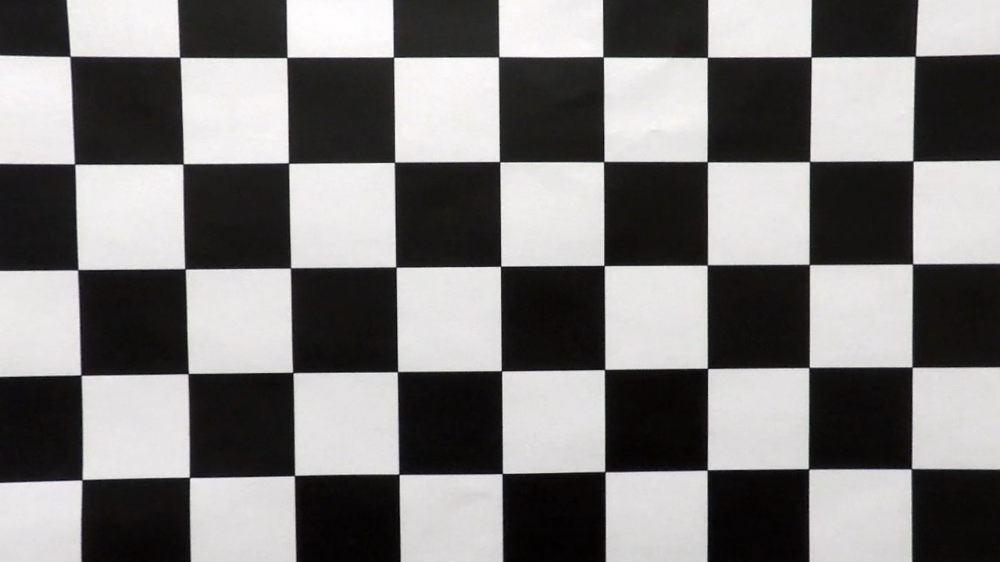
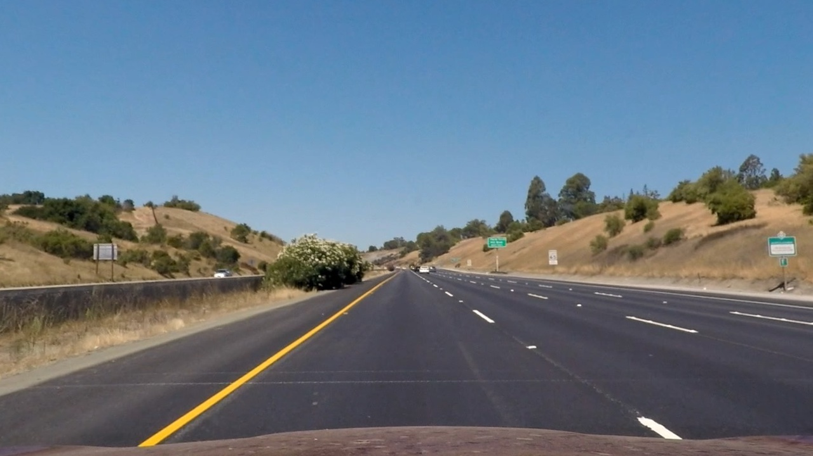
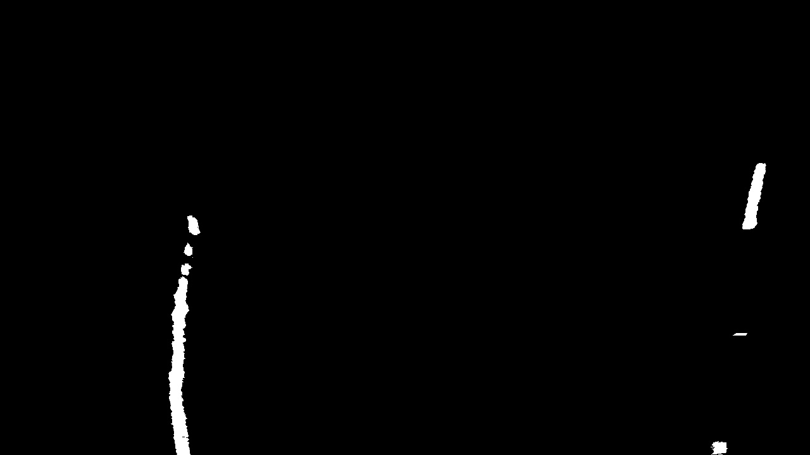
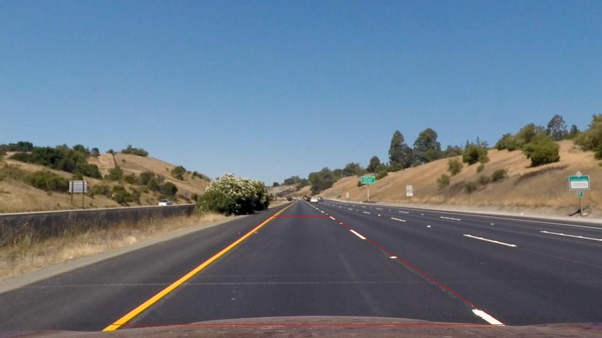
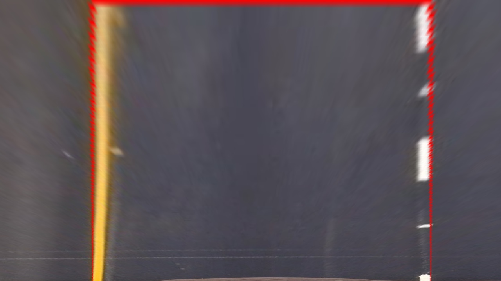
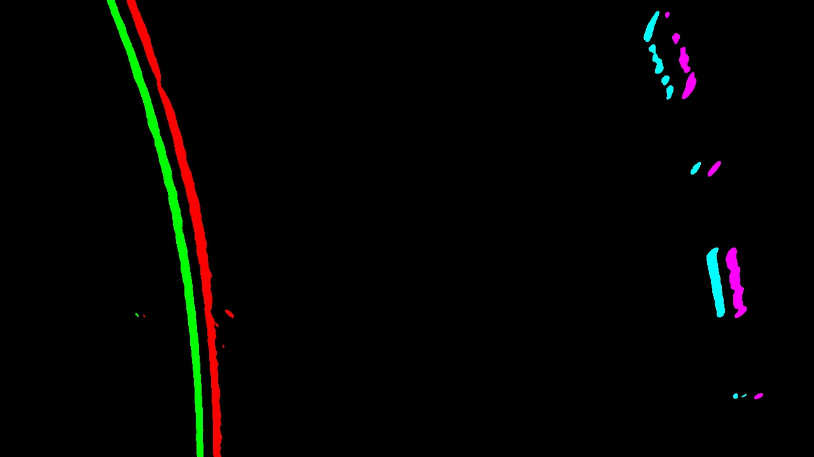
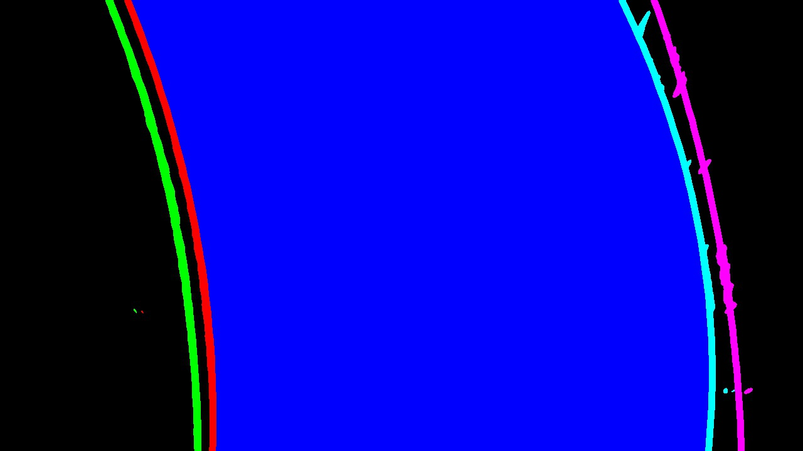
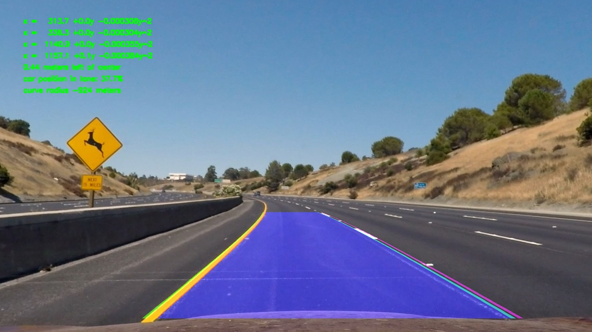

**Advanced Lane Finding Project**
Brian Erickson

The goals / steps of this project are the following:

* Compute the camera calibration matrix and distortion coefficients given a set of chessboard images.
* Apply a distortion correction to raw images.
* Use color transforms, gradients, etc., to create a thresholded binary image.
* Apply a perspective transform to rectify binary image ("birds-eye view").
* Detect lane pixels and fit to find the lane boundary.
* Determine the curvature of the lane and vehicle position with respect to center.
* Warp the detected lane boundaries back onto the original image.
* Output visual display of the lane boundaries and numerical estimation of lane curvature and vehicle position.

All code for this project is in the file [Advanced Lane Lines.ipynb](Advanced Lane Lines.ipynb)

## [Rubric](https://review.udacity.com/#!/rubrics/571/view) Points
### Here I will consider the rubric points individually and describe how I addressed each point in my implementation.  

---
### Writeup / README

#### 1. Provide a Writeup / README that includes all the rubric points and how you addressed each one.  You can submit your writeup as markdown or pdf. 

This file

### Camera Calibration

#### 1. Briefly state how you computed the camera matrix and distortion coefficients. Provide an example of a distortion corrected calibration image.

I used the standard chessboard calibration steps.  I created a class called camera that could perform the calibration, load and save the calibration parameters and then un-distort images using the calibration parameters.

See the class "Camera" in the notebook "./Advanced Lane Lines.ipynb".

The calibrate method in the camera class first creates object points for all supplied chessboard corner images.  I refine the corners by calling the cv2.cornerSubPix method.  `all_image_points` contains all the corners from the images, and 'all_object_points' contains idealized coordinates from the chessboard. I then used the output `all_object_points` and `all_image_points` to compute the camera calibration and distortion coefficients using the `cv2.calibrateCamera()` function.  I  applied this distortion correction to first calibration  image using the `cv2.undistort()` function and obtained this result: 

Before


After


### Pipeline (single images)

#### 1. Provide an example of a distortion-corrected image.

I applied the calibration to all images in the 'test_images' folder and placed the output in the 'output_images' folder, adding the prefix 'undistorted_' to each image so I could correspond with the original images.  Below is a before / after example.  The difference is hard to notice, but there are some faint lines crossing the street in front of the car where I think the transform is most noticeable.

*Before*


*After*


####2. Describe how (and identify where in your code) you used color transforms, gradients or other methods to create a thresholded binary image.  Provide an example of a binary image result.

I experimented with many different color transforms that would best show the lane colors in the various lighting conditions and road conditions in the test video.  I experimented with the different channels of HSV, YUV and RGB.  It turns out that the one I found best to provide contrast with both the yellow and white lane lanes was to utilize the R channel of RGB.

I created binary images of these using an adaptive thresholding technique.  I actually did this after the un-distort step so that my code could concentrate on the lane itself and utilize an image that was completely filled with lane. I find the pixel with 99th percentile intensity and use that as the cut-off.  Since each pictures contains a relatively constant percentage of lane lines when viewed in birds-eye, this worked well.

Below is an example of the output.

**Thresholded Output**


#### 3. Describe how (and identify where in your code) you performed a perspective transform and provide an example of a transformed image.

I created a function called 'birds_eye' that I could use to both transform and un-transform images from the original view to birds-eye view.  I found the src coordinates of the transform by carefully selecting pixel locations at the edges of images with straight lane lines.  I selected dst coordinates by selecting a coordinates that would fill the image with the desired lane and a road on the side, but not include other lanes or points too near the vanishing point where the lane lines are too small to reliably detect.

I use the OpenCV functions cv2.getPerspectiveTransform and cv2.warpPerspective to apply the transforms.  To do the inverse transform, I simply swap the src and dst parameters.
I verified that my perspective transform was working as expected by drawing the `src` and `dst` points onto a test image and its warped counterpart to verify that the lines appear parallel in the warped image.

It is interesting to note that the pixels in the drawn lines themselves get affected by the warp, you can see they are thicker near the top of the image due to the perspective transformation.

**Before transform**


**After transform**


####4. Describe how (and identify where in your code) you identified lane-line pixels and fit their positions with a polynomial?

To identify the lane line pixels, I applied a Sobel transform to the birds-eye images.  Because lane lines are mostly vertical in the birds-eye view, I applied the Sobel in the horizontal direction (dx=1,dy=0).  This will emphasize vertical lines.  I chose a relatively large kernel size of 21 so that edged would be found for the large lane line features but not for smaller road features like road texture.

Here is the code I used for the Sobel transform:

    def detect_edges(im,ksize=21):
        '''
        Returns a simple sobel detection`
        '''
        return cv2.Sobel(im,cv2.CV_32F,dx=1,dy=0,ksize=ksize)
        
After I do the Sobel transform, I use a relative threshold again, this time selecting pixels up to 80% of the 99 th percentile. To keep everything in one image, I use the different red channel for left edges, green channel for right edges and th blue channel to discriminate between left and right images.  

Here is the code:
    def color_edges(im):
        '''
        takes a grayscale birdseye image as input

        returns an image with left edges in the red channel and right edges in the green channel
        left/right split is blue channel (blue=right)
        '''
        e = detect_edges(im)
        right = threshold(e)
        left = threshold(-1.0*e)
        both = np.zeros_like(right)
        both[:,:,0] = left[:,:,0]
        both[:,:,1] = right[:,:,0]
        mid_x = both.shape[1]//2
        both[:,mid_x:,2]=both[:,mid_x:,0]+both[:,mid_x:,1] # add blue channel to right hand pixels
        return both

The final image has edge lines of green/red/cyan/magenta as shown below.

** Example of colored edge lines **


To fit the lane lines, I used a 2nd degree polynomial.  To make sure that outliers didn't unduly distort the line, I used a RANSAC algorithm from SKLEARN.  

    from sklearn.preprocessing import PolynomialFeatures
    from sklearn import linear_model

    def fit_polynomial2(X,Y):
        '''
        returns coefficients,model of 2nd degree polynomial ransac fit
        '''
        X = np.reshape(np.array(X),(len(X),1))
        Y = np.reshape(np.array(Y),(len(Y),1))
        poly = PolynomialFeatures(degree=2)
        X_ = poly.fit_transform(X)
        try:
            model = linear_model.RANSACRegressor(linear_model.LinearRegression(fit_intercept=False),residual_threshold=5)
            model.fit(X_,Y)
        except ValueError:
            model = linear_model.RANSACRegressor(linear_model.LinearRegression(fit_intercept=False))
            model.fit(X_,Y)
        return (model.estimator_.coef_[0], model)

I performed this fit for each of the four detected lane edges by looking at red/green/cyan/magenta channels of the edge highlighted image as above.

def get_line_coefs_for_edges(im):
        '''
        returns four arrays of line coefficents (a,b,c) for the four lane line edges in im
        where x = a + b*y + c*y^2
        assumes edges are colored green, red, cyan, magenta from left to right
        '''
        coef_list = []
        world_coef_list = []

        left_left = np.logical_and(im[:,:,1]>128,im[:,:,2]<128)
        left_right = np.logical_and(im[:,:,0]>128,im[:,:,2]<128)
        right_left = np.logical_and(im[:,:,1]>128,im[:,:,2]>128)
        right_right = np.logical_and(im[:,:,0]>128,im[:,:,2]>128)
        for im_edge in [left_left,left_right,right_left,right_right]:
            y,x = np.nonzero(im_edge)
            h= im.shape[0]-y
            coefs, model = fit_polynomial2(h,x)
            world_coefs, world_model = fit_polynomial2(y*y_meters_per_pixel,x*x_meters_per_pixel)
            coef_list.append(coefs)
            world_coef_list.append(world_coefs)
        return coef_list, world_coef_list
        
I then use the output of the fit to draw lines and the "road" area.  Below is an example:



#### 5. Describe how (and identify where in your code) you calculated the radius of curvature of the lane and the position of the vehicle with respect to center.

I implemented a class called "line_edge" to track each edge line.  I use the the coefficients of the fit polynomial in world coordinates to find the radius of curvature. in the method "radius_of_curvature".

    def radius_of_curvature(self,y=0):
        '''
        radius of curvature in world cordinates, y is relative to car, not image
        '''
        a,b,c = self.world_coefs
        image_radius = ((1 + (2*c*y + b)**2)**1.5) / (2*c) # removed np.absolut
        world_radius = image_radius
        return world_radius

I calculate the position in the lane by finding the midpoint of the lane edges and compare them to the midpoint of the image which I assume is the car.  All of this is done using world coordinates so I get the distance in world coordinates.  This is done in the method 'meters_right_of_center'

    def meters_right_of_center(self):
        l = self.line_edges[1].value_at_y(image_height)
        r = self.line_edges[2].value_at_y(image_height)
        lane_mid = (r+l)/2
        car_mid = image_width/2
        return (car_mid-lane_mid) * x_meters_per_pixel
        
#### 6. Provide an example image of your result plotted back down onto the road such that the lane area is identified clearly.

I plot the lane lines and road surface as above, and then use a reverse warp transform to overlaying the images onto the original (undistorted) road image.  I then add the text for fit coordinates for each lane edge, position from lane center, and road curvatures.

** Image with road and text projected **


---

### Pipeline (video)

#### 1. Provide a link to your final video output.  Your pipeline should perform reasonably well on the entire project video (wobbly lines are ok but no catastrophic failures that would cause the car to drive off the road!).

Here's is a link to my final video result:

[link](output_videos/streamed_project_video.mp4)


---

### Discussion

#### 1. Briefly discuss any problems / issues you faced in your implementation of this project.  Where will your pipeline likely fail?  What could you do to make it more robust?

In addition to following the basic guidelines, I did the following which I think enhanced my output:
- I used an adaptive threshold to find pixels of interest
- I performed edge detection on the birds-eye image instead of the original image.
- I used considered each lane edge separately before fitting lines.

With this, I think there are still many cases where it would fail. For example:
- Strong features that aren't lane lines, like cars changing lanes
- Long sections with faint lane lines
- Very curvy roads, windshield glare, roads with grade changes
- Rainy roads with reflections
- Different styles of lane markers, such as double and double-double lines
- The car crossing out of the lane

Here are some things I believe would improve the performance of my lane tracker:
- Low pass filter on parameters obtained from polynomial fit
- Rejecting polynomial fits that change too fast
- Looking for agreement between the fit of the line edges and rejecting fit lines that don't match the others
- Look for consistency of lines and invalidate results that aren't consistent, for example
    - Line edges shouldn't intersect each other
    - The distance between left and right edges of a lane line should be consistent with lane marking sizes
    - distance between lane lines should be consistent with the expected lane width

    
   


```python

```
